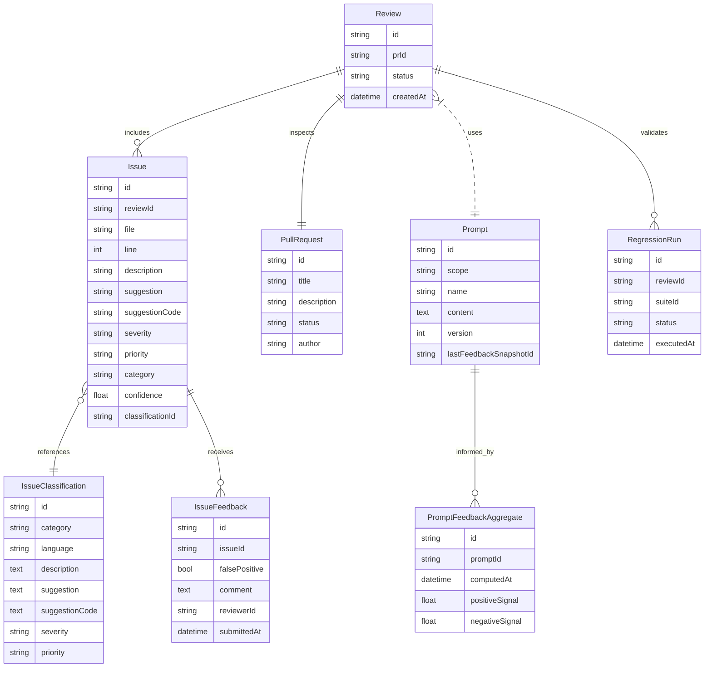

# Pull Request Review Agent PRD

## Overview
The pull request review agent is a backend-driven service that allows users to request automated reviews of GitHub pull requests. Users supply a PR identifier, and the system fetches PR metadata, runs language- and project-aware review prompts, and returns structured review findings. The service also manages prompt templates, issue classifications, reviewer feedback on findings, and continuous prompt improvements driven by that feedback. The backend review agent is implemented with Mastra to orchestrate LLM workflows and tooling.

## Goals
- Automate retrieval of pull request metadata (title, description, changed files, and diffs).
- Apply configurable prompt templates when performing reviews to tailor guidance by project, repository, and language.
- Provide structured, actionable review results including pass/fail status and issue details.
- Allow users to manage prompts and issue classification catalogs.
- Capture reviewer feedback on issues to improve future accuracy.
- Automatically adapt prompts using reviewer feedback signals so future runs incorporate accepted suggestions and suppress confirmed false positives.
- Run regression tests whenever prompts or workflow logic change to guard against quality regressions.

## Non-Goals
- Real-time synchronization with external SCM events beyond explicit review requests.
- Executing CI/CD pipelines or running tests as part of the review.
- Persisting historical analytics dashboards (initial release only stores review data per request).

## User Stories
1. **Submit Review**: As a user, I can input a PR ID and trigger the agent to fetch PR details (title, description, file diffs) so I can review the findings.
2. **View Results**: As a user, I can see whether the PR passes review. If it fails, I can inspect issues including file, line number, description, suggestions, severity, priority, category, and confidence score.
3. **Manage Prompts**: As an admin, I can CRUD overall, project, repository, and language prompt templates that inform review behavior.
4. **Manage Issue Classifications**: As an admin, I can CRUD issue classification entries containing category, language, description, suggestions, severity, and priority values.
5. **Review Feedback**: As a reviewer, I can mark issues as false positives and leave comments to improve the system.
6. **Prompt Auto-Tuning**: As a system operator, I can rely on reviewer feedback to automatically refine prompt templates so the agent learns from past reviews.
7. **Regression Confidence**: As a system operator, I can run a regression test suite whenever prompts or workflow rules change to ensure output quality remains stable.

## Functional Requirements
### Pull Request Intake
- Accepts a `prId` (string) along with repository context.
- Fetches PR metadata via SCM API client (mocked for MVP).
- Normalizes file diffs into per-file change sets with added/removed line metadata.

### Prompt Template Management
- Supports four prompt scopes: overall, project, repository, and language.
- Each prompt record stores: `id`, `scope`, `name`, `content`, `createdAt`, `updatedAt`.
- Provide CRUD operations and list filtering by scope.
- Prompt execution pipeline resolves templates in precedence order: overall → project → repository → language.

### Issue Classification Management
- Issue classifications store: `id`, `category`, `language`, `description`, `suggestion`, `suggestionCode`, `severity`, `priority`.
- Classifications are referenced during issue generation to provide standardized metadata.
- Support CRUD operations and filtering by language, category, and severity.

### Review Execution
- Compose a review prompt using templates, PR metadata, and relevant issue classifications.
- Produce a pass/fail verdict for the PR.
- Surface issues as an ordered list containing:
  - `file`
  - `line`
  - `description`
  - `suggestion`
  - `suggestionCode`
  - `severity`
  - `priority`
  - `category`
  - `confidence`
- Allow reviewers to mark issues as false positives and attach comments.

### Prompt Adaptation
- Aggregate reviewer feedback to compute prompt adjustment signals (e.g., promote guidance tied to accepted fixes, demote language linked to false positives).
- Support scheduled and on-demand prompt refinement jobs that update template contents or weighting metadata.
- Track prompt version history with references to the feedback snapshots that informed each change.

### Regression Testing
- Provide a curated corpus of PR scenarios with expected outcomes to validate prompts and workflow changes.
- Automatically execute the regression suite after prompt updates, workflow modifications, or new prompt versions are published.
- Block deployment of prompt or workflow changes if regression results fall below predefined quality thresholds.

### Audit & Feedback
- Persist review runs with timestamps, PR ID, prompts used, and generated issues.
- Store reviewer feedback (false positive flag, comment text, reviewer id, timestamp).
- Maintain feedback aggregates that map to prompt versions and auto-tuning decisions for auditability.

## Mock API Design
### Authentication
- Use API key header `x-api-key` (mock validation against static key `demo-key`).

### Endpoints
| Method | Path | Description |
| --- | --- | --- |
| `POST` | `/api/reviews` | Trigger a PR review. |
| `GET` | `/api/reviews/:id` | Retrieve review results including issues. |
| `POST` | `/api/reviews/:id/issues/:issueId/feedback` | Submit feedback on an issue (feeds auto-tuning pipeline). |
| `GET` | `/api/prompts` | List prompt templates (filter by `scope`). |
| `POST` | `/api/prompts` | Create a prompt template. |
| `PATCH` | `/api/prompts/:id` | Update a prompt template (auto-tuning jobs call this endpoint). |
| `DELETE` | `/api/prompts/:id` | Delete a prompt template. |
| `POST` | `/api/prompts/:id/preview-regression` | Run the regression suite against a prompt draft. |
| `GET` | `/api/issue-classifications` | List issue classifications (filter by `category`, `language`, `severity`). |
| `POST` | `/api/issue-classifications` | Create an issue classification. |
| `PATCH` | `/api/issue-classifications/:id` | Update an issue classification. |
| `DELETE` | `/api/issue-classifications/:id` | Delete an issue classification. |

### Mock Data Shapes
#### Pull Request Payload
```json
{
  "id": "PR-1024",
  "title": "Add PR review agent endpoints",
  "description": "Implements review workflow and configuration management",
  "status": "OPEN",
  "author": "octocat",
  "files": [
    {
      "path": "apps/backend/src/review/review.controller.ts",
      "changes": [
        { "line": 42, "type": "addition", "content": "return this.reviewService.runReview(dto);" },
        { "line": 57, "type": "deletion", "content": "// TODO: implement" }
      ]
    }
  ]
}
```

#### Review Response
```json
{
  "id": "review-9001",
  "prId": "PR-1024",
  "status": "fail",
  "issues": [
    {
      "id": "issue-1",
      "file": "apps/backend/src/review/review.service.ts",
      "line": 87,
      "description": "Missing null check for SCM response",
      "suggestion": "Add null guard before accessing response body.",
      "suggestionCode": "if (!response) { throw new Error('SCM response missing'); }",
      "severity": "high",
      "priority": "p0",
      "category": "robustness",
      "confidence": 0.82,
      "classificationId": "cls-robustness-null-check"
    }
  ],
  "promptsUsed": {
    "overall": "Ensure code follows project security and reliability standards.",
    "project": "Backend services must validate external API responses.",
    "repository": "Review NestJS controllers for missing guards.",
    "language": "TypeScript code should handle undefined values."
  },
  "regressionResults": {
    "suiteId": "regression-core",
    "status": "pass",
    "executedAt": "2024-04-21T08:15:00.000Z"
  }
}
```

#### Feedback Submission
```json
{
  "issueId": "issue-1",
  "falsePositive": true,
  "comment": "The response is already validated upstream.",
  "reviewerId": "alice",
  "submittedAt": "2024-04-20T15:32:10.000Z",
  "feedbackSignals": {
    "promptIds": ["prompt-overall-default"],
    "action": "demote-guidance",
    "confidence": 0.75
  }
}
```

#### Prompt Template
```json
{
  "id": "prompt-overall-default",
  "scope": "overall",
  "name": "Overall Reliability",
  "content": "Ensure submissions meet reliability and security standards.",
  "createdAt": "2024-04-19T12:00:00.000Z",
  "updatedAt": "2024-04-21T09:45:00.000Z",
  "version": 3,
  "lastFeedbackSnapshotId": "feedback-aggregate-2024-04-21"
}
```

#### Issue Classification
```json
{
  "id": "cls-robustness-null-check",
  "category": "robustness",
  "language": "typescript",
  "description": "Missing null or undefined guard before dereferencing values.",
  "suggestion": "Add null checks before using data from external sources.",
  "suggestionCode": "if (!value) { throw new Error('Value is required'); }",
  "severity": "high",
  "priority": "p0"
}
```

## Data Model Sketch


## Open Questions
- Should prompt precedence support per-branch overrides?
- Do we need webhook callbacks when reviews finish?
- How should false positive feedback influence future reviews (manual triage vs. automated learning)?
- Which metrics and thresholds should gate regression suite failures before publishing prompt updates?

